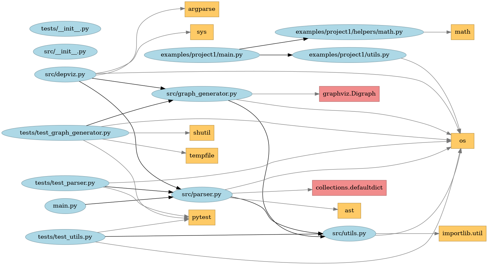

# Guide manual

Team : Théo Pirouelle

<a href="https://www.python.org/">
  
</a>


---

## Installation

> [!NOTE]
> For information, the code has been developed and works with the following library versions:
> | Library | Version |
> | --- | --- |
> | pytest | 8.4.2 |
> | graphviz | 0.21 |

Please also remember to install Python. The code was developed and works with Python 3.10.12.

---

## User manual

To simply run the script, you can use the following command:
```bash
python[3] -m src.depviz --path PATH
```

For more details, you have the following helper:
```bash
usage: depviz.py [-h] --path PATH [--export PATH] [--format {png,svg,pdf,dot}]

Internal dependency analyser for Python projects.

options:
  -h, --help                   Show this help message and exit
  --path PATH                  Path to the Python project directory to be analysed. (default: None)
  --export PATH                Path (without extension) to export the graph (e.g. ./output/dependencies). (default: None)
  --format {png,svg,pdf,dot}   Graph output format (default: png). (default: png)
```

---

## Result

Here is an example of the results achieved with this project:

