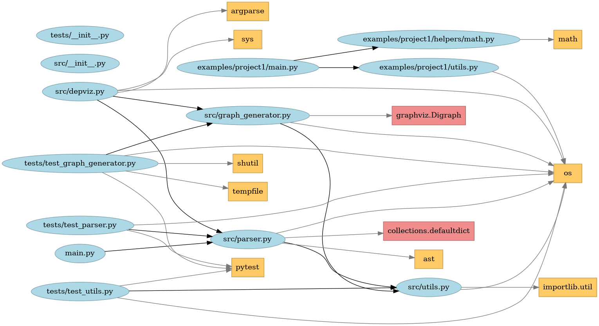

# Guide manual

Team : Théo Pirouelle

<a href="https://www.python.org/">
  
</a>


---

## Installation

> [!NOTE]
> For information, the code has been developed and works with the following library versions:
> | Library | Version |
> | --- | --- |
> | pytest | 8.4.2 |
> | graphviz | 0.21 |

Python 3.10 or newer is required. From the repository root, install the Python dependencies:

```bash
python -m pip install -r config/requirements.txt
```

PNG, SVG and PDF exports also require the native [Graphviz application](https://graphviz.org/download/).
On Debian/Ubuntu, install it with `sudo apt install graphviz`. On Windows, install the
Graphviz Windows package and add its `bin` directory to `PATH`. Check the installation
with `dot -V` from a new terminal.

Text analysis uses only Python's standard library. DOT export requires the Python
`graphviz` package, but does not require the native `dot` executable.

---

## User manual

To simply run the script, you can use the following command:
```bash
python -m src.depviz --path examples/project1
```

Without `--export`, imports are displayed in the terminal and no graph file is
created. The command prints a reminder showing how to request an export.

Direct script execution is also supported, including help and graph exports:

```bash
python3 src/depviz.py --path examples/project1/
python3 src/depviz.py -h
```

Use `python` instead of `python3` if that is your interpreter's command name.
When launching the script by absolute path from another directory, `--path` and
`--export` remain relative to your current working directory.

For more details, you have the following helper:
```bash
usage: depviz.py [-h] --path PATH [--export PATH] [--format {png,svg,pdf,dot}]

Static dependency analyser for Python projects.

options:
  -h, --help                   Show this help message and exit
  --path PATH                  Python import root or package directory to analyse.
  --export PATH                Destination directory or filename without extension; omit for terminal output only.
  --format {png,svg,pdf,dot}   Graph output format. (default: png)
```

Export a graph into the current directory, without installing native Graphviz:

```bash
python -m src.depviz --path examples/project1 --export dependencies --format dot
```

For a rendered image, use `--format png`, `svg` or `pdf`. Parent output directories
are created automatically.

To save `dependency_graph.png` in the current working directory:

```bash
python3 src/depviz.py --path examples/project1/ --export . --format png
```

An existing directory passed to `--export` receives `dependency_graph.<format>`.
To create a new destination directory, end its path with `/`, for example
`--export output/`. Otherwise, the path is treated as a filename without extension:
`--export output/dependencies` writes `output/dependencies.png` with the default format.

### Resolution and diagnostics

`--path` defines the import root. For `repo/src/my_package`, choose `--path repo/src`
when imports start with `my_package`. You can also select a package directory that
contains `__init__.py`; its folder name becomes the package prefix.

Absolute imports resolve from that root. Relative imports retain their number of
leading dots and resolve from the importing file's package. Packages map to their
`__init__.py`, and same-named files in unrelated directories are not interchangeable.
Nested standalone scripts must be analysed with their own import root.

Project files are resolved first. Standard modules are recognised by Python's
standard-library name index, and installed dependencies by distribution metadata in
the interpreter running the analyser. No project or dependency package is imported
to discover it. Uninstalled dependencies remain unknown. The graph uses blue for
internal files, yellow for standard/installed modules, and red for unresolved imports.

Virtual environments, version-control directories and common caches are excluded
from both source collection and module indexing. Environments with custom folder
names are also excluded when they contain `pyvenv.cfg`.

Python encoding declarations and UTF-8 BOMs are honoured. Unreadable or invalid files
produce a diagnostic on stderr while the other files are still analysed. Requested
exports can therefore be partial; the command returns exit code 1 if any source
could not be analysed or an export failed, and 0 after a complete successful analysis.

This is a static graph of explicit import statements, including imports inside
functions and conditional blocks. Dynamic imports, changes to `sys.path`, custom
import hooks and runtime re-exports are not evaluated. A namespace package without
an `__init__.py` has no single file node, although its concrete submodules resolve.

### Python API

`extract_imports_from_file()` now returns `ImportReference` objects instead of strings.
Each reference stores `module`, `name` (for a from-import) and `level` (relative depth).
`collect_all_dependencies()` returns these lists indexed by relative file path.
Use `str(reference)` to display the import statement or `reference.target` for its
qualified target. Module maps consistently use `dict[str, list[str]]`.

`create_dependency_graph()` returns a Graphviz `Digraph` for inspection without
rendering. `build_dependency_graph()` exports it and returns the output filename.

### Tests

```bash
python -m pytest tests/
```

The tests cover exact import destinations and graph edges, package discovery,
side-effect-free analysis, encodings, exclusions, diagnostics and CLI exports.
PNG/SVG/PDF integration tests are skipped locally when `dot` is unavailable.
CI installs and checks Graphviz before running tests on Linux (Python 3.10–3.12)
and Windows (Python 3.12).

---

## Result

Here is an example of the results achieved with this project:

